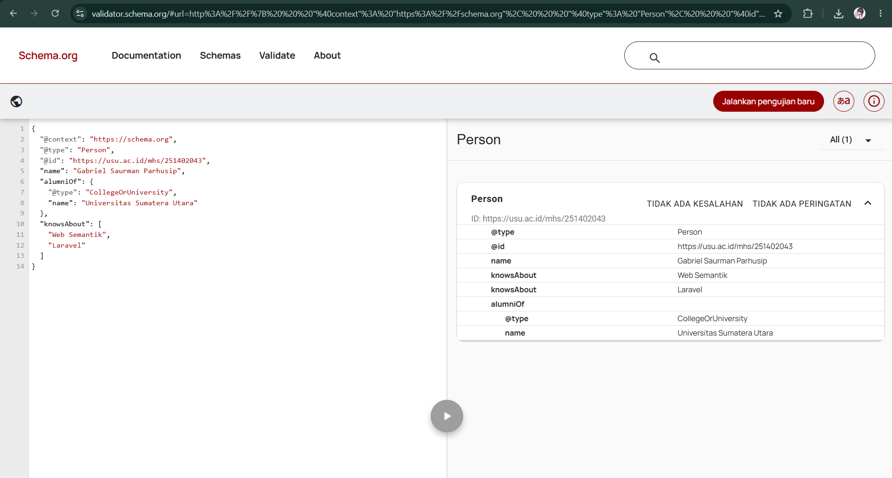
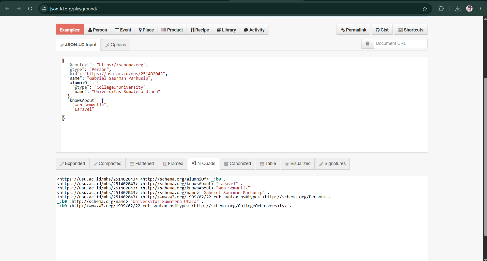
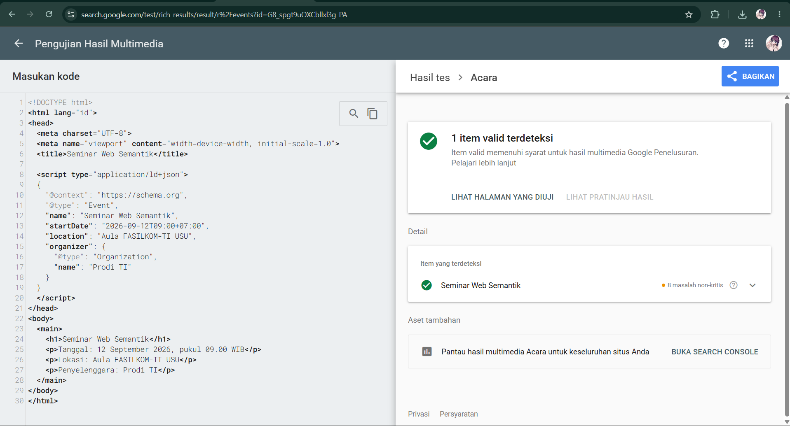

# Latihan Pertemuan 3 - JSON-LD dan Structured Data

## Identitas
- Nama: Aldiva Roelya Padang
- NIM: 251402007

## Struktur Hasil
- `profil_saya.jsonld`
- `profil_perbaikan.jsonld`
- `seminar.html`
- folder `screenshots`

## 1. JSON Biasa dan JSON-LD
1. Perbedaan fungsi kunci: kalo pada JSON biasa hanyalah nama atribut yang maknanya ditentukan oleh aplikasi yang menggunakannya, sedangkan pada JSON-LD memiliki makna yang sudah didefinisikan dalam kosakata Schema.org pada @context.
2. Fungsi `@context`, `@type`, dan `@id`: @context untuk menghubungkan stilah lokal ke kosakata atau standar global, jadinya arti data nya jelas
    sedangkan pada @type untuk menjelaskan atau menntekukan jenis entitas yang di jelaskan. pada soal adalah personh contohn nanusia atau seseorang. lalu @id untuk memberikann identitas unik untuk suatu entitas sehingga dapat di hubungkan dengan data lain yang ada di weeb semantik
3. Node tanpa `@id`: jika node tanpa @Id akan menjadi node anonim ataun node blank
## 2. Pemeriksaan schema.org
1. Alasan memilih tipe paling spesifik: ...
2. Nama properti dan bahasa nilai: ...
3. Manfaat array pada `knowsAbout`: ...

## 3. Perbaikan Lima Kesalahan
| No. | Bagian Salah | Alasan | Perbaikan |
|---|---|---|---|
| 1 | ... | ... | ... |
| 2 | ... | ... | ... |
| 3 | ... | ... | ... |
| 4 | ... | ... | ... |
| 5 | ... | ... | ... |

## 4. Triple dari JSON-LD Playground
Tuliskan satu baris N-Quads yang terbentuk:

```text
ISI_TRIPLE
```

## 5. Hasil Validasi
- Schema Markup Validator: ...
- Rich Results Test: ...
- JSON-LD Playground: ...

## 6. Refleksi
1. Mengapa `@context` disebut jembatan menuju makna?
2. Apa perbedaan fungsi Schema Markup Validator dan Rich Results Test?
3. Mengapa isi JSON-LD harus sama dengan konten yang terlihat pada halaman?

## Bukti



